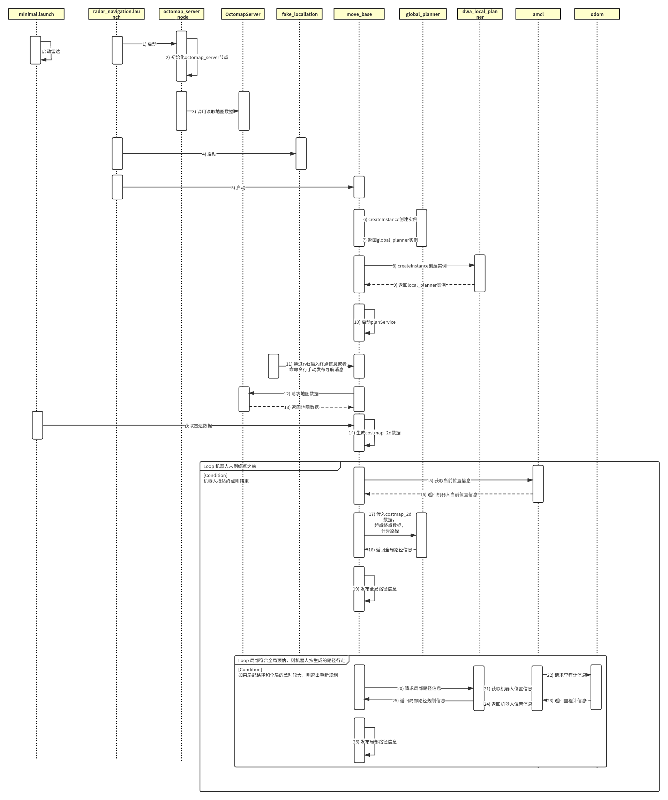
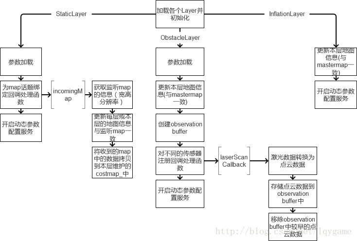

# 两点导航介绍

## 一、两点导航整体流程

整体流程图：



### 1 构造函数MoveBase::MoveBase()

move_base.cpp是两点导航的核心，该程序构造函数MoveBase::MoveBase()创建MoveBaseActionServer负责响应路径规划请求，回调函数为MoveBase::executeCb()，当收到目标点消息goal时，执行回调函数。

```
59    as_ = new MoveBaseActionServer(ros::NodeHandle(), "move_base", boost::bind(&MoveBase::executeCb, this, _1), false);
```

同时构造函数MoveBase::MoveBase()创建一个全局路径规划对象planner和全局代价地图对象planner_costmap_ros和局部路径规划对象tc和局部代价地图对象controller_costmap_ros。

```
113      planner_costmap_ros_ = new costmap_2d::Costmap2DROS("global_costmap", tf_);

118      planner_ = bgp_loader_.createInstance(global_planner);
119      planner_->initialize(bgp_loader_.getName(global_planner), planner_costmap_ros_);


126      controller_costmap_ros_ = new costmap_2d::Costmap2DROS("local_costmap", tf_);

131      tc_ = blp_loader_.createInstance(local_planner);
132      ROS_INFO("Created local_planner %s", local_planner.c_str());
133      tc_->initialize(blp_loader_.getName(local_planner), &tf_, controller_costmap_ros_);
```

### 2 回调函数MoveBase::executeCb()

该函数负责控制机器人的移动，函数内部处于循环状态。

当收到新目标goal或者goal的坐标系改变时，执行全局路径规划线程MoveBase::planThread()，该线程内通过条件判断后使用makePlan()获得通过迪杰斯特拉算法计算得到的最优全局路径。

```
578      bool gotPlan = n.ok() && makePlan(temp_goal, *planner_plan_);
```

执行全局路径规划后通过条件判断执行局部路径规划executeCycle()。

```
758      bool done = executeCycle(goal, global_plan);
```

一般来说，当局部路径规划到达目标点后退出回调函数MoveBase::executeCb()循环。

### 3 全局路径规划makePlan() 

makePlan()函数位于navfn_ros.cpp：

```
193   bool NavfnROS::makePlan(const geometry_msgs::PoseStamped& start, 
      const geometry_msgs::PoseStamped& goal, std::vector<geometry_msgs::PoseStamped>& plan)
```

该函数调用：

```
198    bool NavfnROS::makePlan(const geometry_msgs::PoseStamped& start, 
      const geometry_msgs::PoseStamped& goal, double tolerance, std::vector<geometry_msgs::PoseStamped>& plan)
```

该函数主要使用calcNavFnDijkstra()函数规划全局路径：

```
264    planner_->calcNavFnDijkstra(true);
```

calcNavFnDijkstra()位于navfn.cpp，全称为：

```
289  bool NavFn::calcNavFnDijkstra(bool atStart)
```

该函数首先调用setupNavFn()初始化potential地图：

```
364      void  NavFn::setupNavFn(bool keepit)
```

该函数中调用propNavFnDijkstra()来依据代价地图来更新potential地图中的值，该函数是计算起始点到当前点的potential，选取当前点周围四个点中最小的值然后加上该点的cost值，直到将起始点可到终点的相关点的cost计算完毕：

```
295      propNavFnDijkstra(std::max(nx*ny/20,nx+ny),atStart);
```

然后调用函数calcPath()选取代价最小的路径即可：

```
298      int len = calcPath(nx*ny/2);
```

### 4 局部路径规划executeCycle()

MoveBase::executeCycle()函数主要通过计算出当前速度来控制机器人完成局部路径行驶，速度的计算采用函数computeVelocityCommands()

```
902     if(tc_->computeVelocityCommands(cmd_vel))
```

该函数定义在dwa_planner_ros.cpp文件中：

```
264     bool DWAPlannerROS::computeVelocityCommands(geometry_msgs::Twist& cmd_vel)
```

该函数通过条件判断后调用函数dwaComputeVelocityCommands()；

```
302     bool isOk = dwaComputeVelocityCommands(current_pose_, cmd_vel);
```

该函数调用findBestPath()，采用动态窗口方法获得最优局部路径：

```
209    base_local_planner::Trajectory path = dp_->findBestPath(global_pose, robot_vel, drive_cmds);
```

该函数定义在dwa_planner.cpp中，其中主要功能函数为findBestTrajectory():

```
317    scored_sampling_planner_.findBestTrajectory(result_traj_, &all_explored);
```

findBestTrajectory()定义在simple_scored_sampling_planner.cpp中，分为两个主要部分，一部分是通过x速度和角速度采样进行路径前向模拟生成，另一部分是对每个模拟路径进行代价评分，选择评分为正数且最小的路径作为最优局部路径，同时发布该路径下的速度。

生成路径函数调用为：

```
100        gen_success = gen_->nextTrajectory(loop_traj);
```

评分函数部分为：

```
105        loop_traj_cost = scoreTrajectory(loop_traj, best_traj_cost);
```

在评分函数中会对每条路径调用以下存储在代价函数数组critics中代价函数，每个代价函数计算出的代价被叠加作为该路径的总代价输出：

```
    std::vector<base_local_planner::TrajectoryCostFunction*> critics;
    critics.push_back(&oscillation_costs_); // discards oscillating motions (assisgns cost -1)
    critics.push_back(&obstacle_costs_); // discards trajectories that move into obstacles
    critics.push_back(&goal_front_costs_); // prefers trajectories that make the nose go towards (local) nose goal
    critics.push_back(&alignment_costs_); // prefers trajectories that keep the robot nose on nose path
    critics.push_back(&path_costs_); // prefers trajectories on global path
    critics.push_back(&goal_costs_); // prefers trajectories that go towards (local) goal, based on wave propagation
    critics.push_back(&twirling_costs_); // optionally prefer trajectories that don't spin
```

### 5 costmap

costmap初始化：



代价地图由障碍层（obstacle_layer）、静态层（static_layer）、膨胀层（inflation_layer）组合而成，而障碍层（obstacle_layer）需要体素层（voxel_layer）结合使用。

静态层根据静态地图生成，静态地图由三值构成，0（空闲区）、-1（未知区）、100（障碍物），将障碍物所在的网格cost设置为254，未知区设置为255，空闲区设置为0。

膨胀层依据根据每个障碍物点向外以膨胀半径进行膨胀，膨胀区的cost设置按照膨胀距离递减至0。

障碍物层cost值设置同上，差别在于是根据传感器数据进行实时更新，动态窗口维护一个限定大小的障碍物层，当传入3D传感器数据时，需要先经过体素层进行处理。体素层设置一个障碍物高度范围，采用属于该高度范围的点，同时对于一个z竖直列的数据分辨率和高度也是可以设置。当某一竖直列有有一个数据是已知的，该列就是已知的；当一个竖直列障碍物点不超过两个，就认为该竖直列是空闲的。障碍物层就是有体素层投影到二维平面获得。